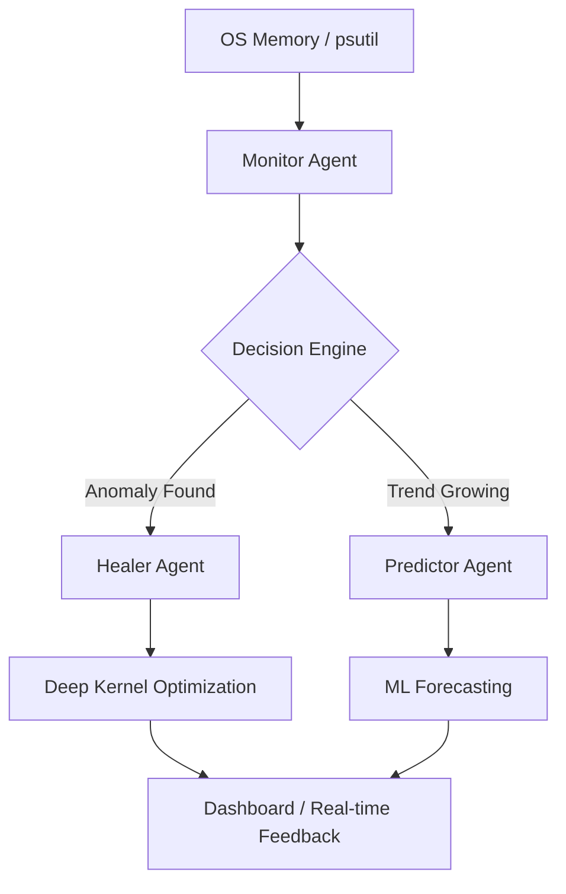

🧠 Self-Healing Memory (SHM)
============================

> **Autonomous System Memory Management** powered by real-time ML forecasting, Agentic Self-Healing, and Deep Kernel-level Optimization.

  

---

## 🔍 Overview

**Self-Healing Memory (SHM)** is a sophisticated monitoring and optimization suite that treats system RAM as a "living" entity. Unlike static cleaners, SHM utilizes isolation forests and exponential smoothing to predict memory exhaustion before it happens, triggering autonomous "healing" actions.

### ✨ Key Features

*   **Flat UI Dashboard**: A high-performance, real-time web interface built with Vanilla JS and Chart.js.
*   **Predictive ML Engine**: Uses *Holt-Winters Exponential Smoothing* to forecast memory trends up to 6 hours ahead.
*   **Anomaly Detection**: Employs an *Isolation Forest* model to detect unusual memory spikes or leaks.
*   **Smart Healing**: A multi-agent system (Monitor, Healer, Predictor) that collaborates to maintain system health.
*   **Deep Kernel Optimization**: Implements Windows-native `NtSetSystemInformation` and `EmptyWorkingSet` calls to flush standby lists and trim process working sets safely.

---

## 🏗️ System Architecture



### 🤖 The Agent Crew

*   **Monitor Agent**: Continuous polling and anomaly flagging.
*   **Healer Agent**: Executes targeted cleanup based on ML "Brain" success scores.
*   **Predictor Agent**: Maps out future resource usage to warn users of impending slowdowns.

---

## 📂 Project Structure

```bash
Self_Healing_Memory/
├── app/
│   ├── ml/                # AI Core (Anomaly Detector, Holt-Winters Predictor)
│   ├── event_store.py     # SQLite persistence for logs and samples
│   ├── memory_core.py     # Windows-native Kernel API calls (RAM cleaning)
│   └── monitor_agent.py   # Background thread control logic
├── static/
│   ├── css/               # Modern "Flat UI" design system
│   └── js/                # Modular Chart.js and API logic
├── templates/
│   └── dashboard.html     # Main Single Page Application (SPA)
├── main.py                # Entry point (Bootstrap & Flask Runner)
├── data/                  # Local persistence (.db files)
└── logs/                  # System & Agent activity logs
```

---

## 🚀 Getting Started

### 1. Prerequisites
- **Windows OS** (required for Deep Optimization features)
- **Python 3.10+**
- **Administrator Privileges** (required to flush system standby lists)

### 2. Installation

1. Clone the repository:
   ```bash
   git clone https://github.com/KushalLimbasiya/Self_Healing_Memory.git
   cd Self_Healing_Memory
   ```

2. Install dependencies:
   ```bash
   pip install -r pyproject.toml  # or use pip install psutil numpy statsmodels flask
   ```

3. Run the application:
   ```bash
   python main.py
   ```

4. Open your browser:
   Visit `http://localhost:5000` to view the **Healer Dashboard**.

---

## 🛠️ Optimization Methods

| Method | Component | Level | Description |
| :--- | :--- | :--- | :--- |
| **Quick Heal** | GC + Local Trim | Application | Performs Garbage Collection and trims the SHM app's own memory. |
| **Clean RAM** | System-wide Trim | Kernel/OS | Iterates through ALL system processes to trim working sets. |
| **Force Heal** | Healer Brain | Agentic | The ML Agent chooses the best action based on historical success. |

---

## 💡 Technologies Used

*   **Backend**: Flask (Python)
*   **ML Stack**: NumPy, Scikit-learn (Isolation Forest), Statsmodels (Holt-Winters)
*   **Kernel Ops**: `ctypes` (Windows API: `psapi`, `ntdll`)
*   **Frontend**: Vanilla HTML5/CSS3 (Flat UI), Chart.js
*   **Agents**: Custom Multi-threaded Agentic Framework

---

## ✍️ Authors

Made with 💻 by [Kushal Limbasiya](https://github.com/KushalLimbasiya) & [MeettPaladiya](https://github.com/MeettPaladiya)
